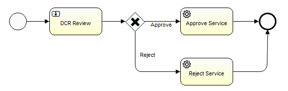

# Data Change Request Review

### Overview
Data Change Request Review is a process for reviewing Data Change Requests initiated for Reltio profiles. As a result of review, a DCR can be approved (which results in an Apply DCR operation) or rejected (which results in a Reject DCR operation).

### Business Process Definition
Out-of-the-box business process definition for Data Change Request Review:

