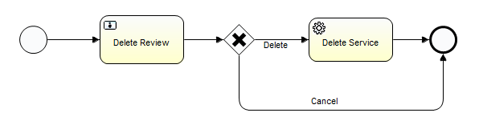

# Delete Profile Review

### Overview
Delete Profile Review is a process for reviewing intended deletions of Reltio profiles. As a result of review, deletion can be confirmed (which results in a Delete operation) or ignored.
 
### Business Process Definition
Out-of-the-box business process definition for Delete Profile Review:

