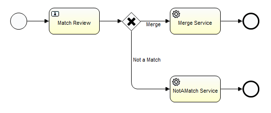

# Potential Match Review

### Overview
Potential Match Review is a process for reviewing potential matches of Reltio profiles. As a result of review, a potential match can be confirmed (which results in a Merge operation) or not confirmed (which results in a Not a Match operation).
 
Reltio Cloud also enables automatic matching and merging based on configurable rules. 
 
### Business Process Definition
Out-of-the-box business process definition for Potential Match Review:

